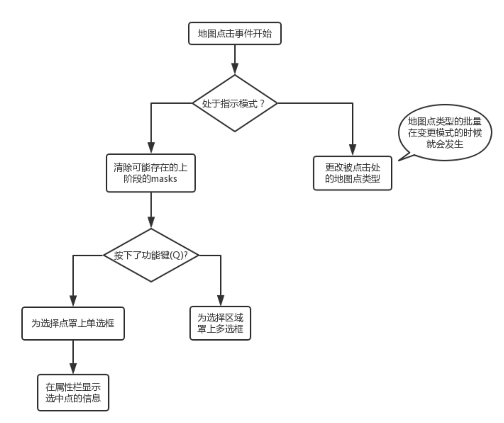

## 地图编辑器系统技术说明文档
```
@author 叶忠豪
@date 2017-8-15
```
### 1.需求概述
#### 1.1 业务需求描述
> 介绍产品的需求，例如需要实现什么样的功能，哪些方面有什么特殊的需求，另外注明那些需求在本期开发中完成，哪些放在以后的开发中实现。

地图编辑器需要实现的功能包括:
+ 载入本地的地图数据文件，并将其可视化
+ 在系统内轻松编辑地图中的各个点的属性
+ 可以将编辑好的地图文件数据，持久化保存到本地
+ 系统应可以适应将来地图点类型和各类型地图点属性数量的增加
+ 具备良好的可移植性，启动方式简单
+ 可以扩展或收缩地图大小
+ 显示一些地图的高层次特征（如道路权值信息，特定地图点的入口信息）
+ 记录历史编辑动作序列，并回跳到任意编辑阶段

除了最后两项功能外，其余功能均已在本期开发中完成。

### 2.系统概要设计
#### 2.1 系统结构
> 此处介绍整个系统的各个组成模块，以及每个模块大概的实现的功能

系统的组成模块包括：
+ 用户接口模块
    该模块包括一个用以显示数据及编辑数据的网页index.html，和一个修改配置信息的config.json文件。
+ 后台处理模块
    该模块的功能包括绘制地图及响应用户操作，由mapEditor.json和display.js组成

#### 2.2 系统模块介绍
> 以下针对每一个子模块、子系统写一节说明文档，简单描述这个模块中实现的业务逻辑、使用到的数据结构以及一些重要的业务处理流程

用户接口模块中的web前端所用的插件包括boostrap，pixiJS，jquery, jquery-Mousewheel和文件保存插件FileSaver。

后台处理模块大致可以划分为地图绘制、操作响应、信息显示三个子模块。

##### 地图绘制子模块
该模块负责读入地图数据信息，处理csv格式数据，利用pixiJS库，将每个地图点作为Sprite绘制到Stage上。

主要的数据结构：
+ QT_Map: 地图点数据二维数组
+ Grids:  地图点sprites二维数据
+ Mask: 地图点Masks二维数据
+ NameMap: 配置信息

##### 操作响应子模块
该模块负责响应用户的操作。地图canvas支持的操作包括点击、拖拽和滚轮缩放。

后两者只需读取鼠标数据，对地图点sprites的坐标位置或大小进行修改即可。

前者的业务处理流程见下图



主要的数据结构：
+ stateTable: 记录着当前的全局状态信息

##### 信息显示子模块
该模块负责在html中动态添加信息，包括：
+ 选中地图点时，在属性栏显示被选中点的信息。
+ 根据配置文件，动态加载工具栏内的地图点
+ 自定义工具栏的功能实现

主体代码包含在display.js文件中。

### 3.系统实现
#### 3.1 开发技术
> 此处罗列出实现这个系统中所使用的所有开发技术，包括使用的数据库、开发语言、开发框架等。

系统使用了web前端技术来提供用户接口，其中地图使用pixiJS框架来绘制，其余部分使用bootStrap框架绘制。

后台逻辑全部都在浏览器前端，由使用js实现。

由于pixiJS要求在网页根目录运行一个Http服务器，故系统里包括一个python3自带的CGI服务器。

#### 3.2 系统实现
> 此节不需要详细列出整个系统的实现细节，需要针对每个业务功能模块列出实现该模块中关键包、类、函数等，以方便查询。此外对于使用的一些比较特殊的算法实现进行必要的说明。

用户接口模块的主体是html文件，此处略去不谈

如前所述，后台处理模块可以划分为地图绘制、操作响应、信息显示三个子模块，以下是各个子模块的关键函数

##### 地图绘制子模块

+ newMap(row, col): 新建一张指定行数和列数的地图
+ loadMap(mapFileData): 根据输入的地图文件数据，绘制一张地图
+ processData(field): 解析单条地图字段，转化为mapPoint对象
+ createSprite(x, y): 根据QT_Map数组信息，绘制坐标为(x, y)的单个地图点
+ clearStage():  清空地图

##### 操作响应子模块

+ onSpriteClick(): 处理地图点击事件
+ zoom(): 处理滚轮缩放事件
+ startDrag(): 处理拖拽事件
+ modeChange(): 变更操作模式时触发

##### 信息显示子模块

略